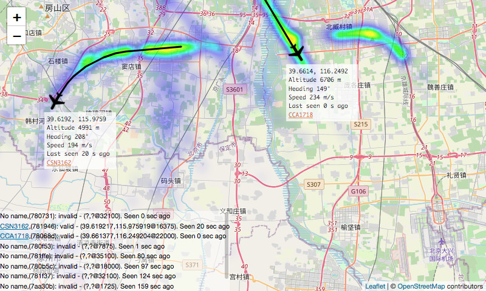

# 1090WebClient

A light-weight web client for plane spotting using [dump1090](https://github.com/MalcolmRobb/dump1090).

## Install
This program can be installed with either dump1090 built-in web server or an
external web server.

When using the dump1090 built-in web server, copy the source files to the HTML
directory according to your dump1090 configuration, e.g.
`/usr/local/share/dump1090` if you set `PREFIX=/usr/local` when building it;
leave `DUMP1090_HTTP_URL_BASE` setting with `null`. You should access the web
page using `index.html` file name explicitly.

When using an external web server, copy the source files to preferred location
under your web server document directory; edit `map.js` to set
`DUMP1090_HTTP_URL_BASE` variable to point at your dump1090 data source.

Either install a copy of [Leaflet](https://leafletjs.com/) (`leaflet.css` and
`leaflet.js`) to the same directory of this program, or uncomment the
corresponding URLs in `index.html` to use an external CDN for Leaflet.

## What is this?
Super, super simple (plain js/css/html) dump1090 web client using [Leaflet](https://leafletjs.com/) for maps.

Currently set up to use [OpenStreetMap](https://openstreetmap.org/) for map tiles but any leaflet-supported map tile service should work (see the list of [tile servers](https://wiki.openstreetmap.org/wiki/Tile_servers)).

Note: This is not 'production-ready' code - it works, but it's also, for example, consuming the server's data as HTML in places - don't just throw this on the internet if you don't know what you're doing.

## Screenshot

## FAQ
### Cross-Origin Errors
If you installed the program with an external web server, you may encounter
this error because the data source and the external web server are separated
sites.

Depending on the version of dump1090 you have and your setup, there might be a slight modification you need to make in order not to get cross-origin errors. (Or you can install my [fork](https://github.com/Slord6/dump1090), where I did this already but it's not too hard to do)

I've tried to write the following instructions so someone who's never written code in their life can fix it, but if you have problems feel free to open an issue and I'll try and help you out.

The following instructions assume:
- You have `git clone`d the [dump1090](https://github.com/MalcolmRobb/dump1090) repository as the instructions there explain
- You are running a linux system (in my case [raspbian](https://www.raspberrypi.org/downloads/raspbian/)). However, the instructions should be fairly similar for other setups.
- You are `ssh`-ing into the system or only have a command line (if not and you have a GUI, then you can open the file with any text editor and start at #3)

1) Navigate to the cloned directory on the command line
2) Open the `net_io.c` file - `nano ./net_io.c`
3) Now we need to edit the headers sent in the HTTP responses
    - Find the function with the name `handleHTTPRequest` and the section commented `// Create the header and send the reply` (In nano you can search with `Ctrl-W`)
    - After `"Content-Length: %d\r\n"` add `"Access-Control-Allow-Origin: *\r\n"` on a new line
    - Save the file (in nano this is `Ctrl-X` and then `Y` to save)
4) Run `make` in the same directory to rebuild dump1090
5) Run `./dump1090 --net --interactive` and open or refresh the client - the issue should be resolved (if not, open an issue)

### No planes
If you don't see any planes, check the console to see if your problem reveals itself there. If not, open an issue.

### Change default location
Edit `map.js` to change `RECEIVER_POSITION` or `INITIAL_POSITION` variable.

### Change data fetch frequency
You want the `dataFetchBreakTime` variable

## Licence
See separate file (but its MIT)
